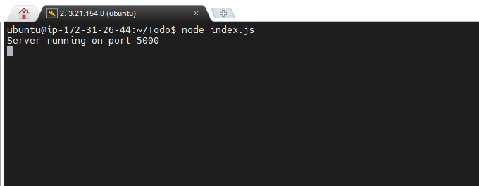
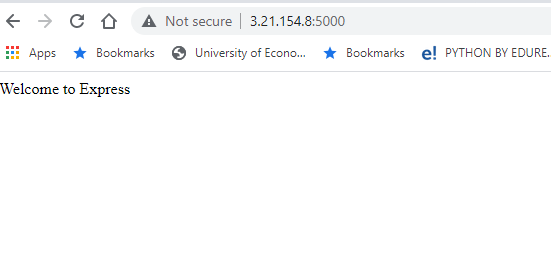
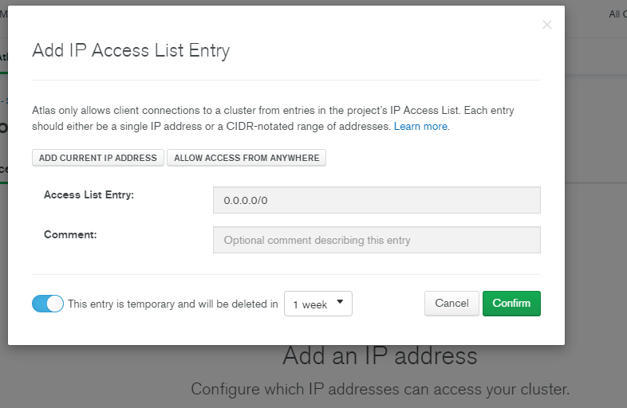
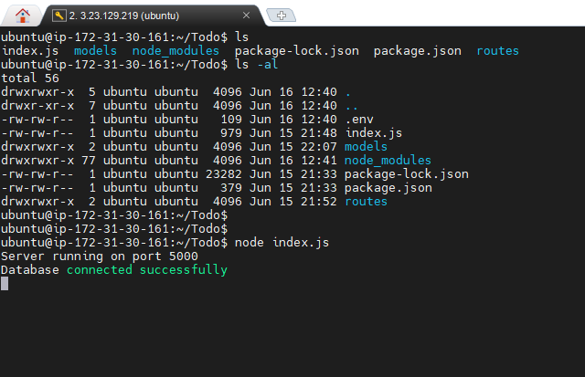
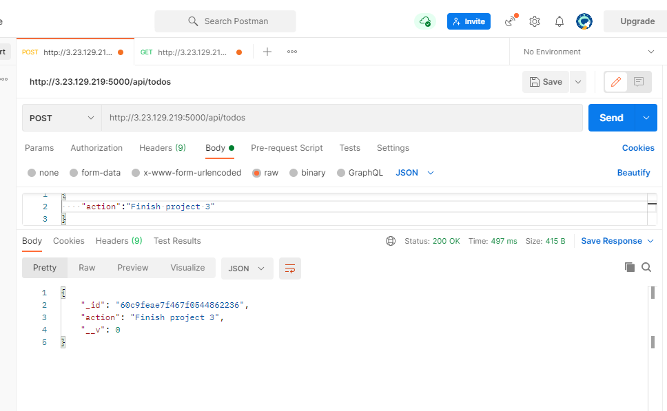
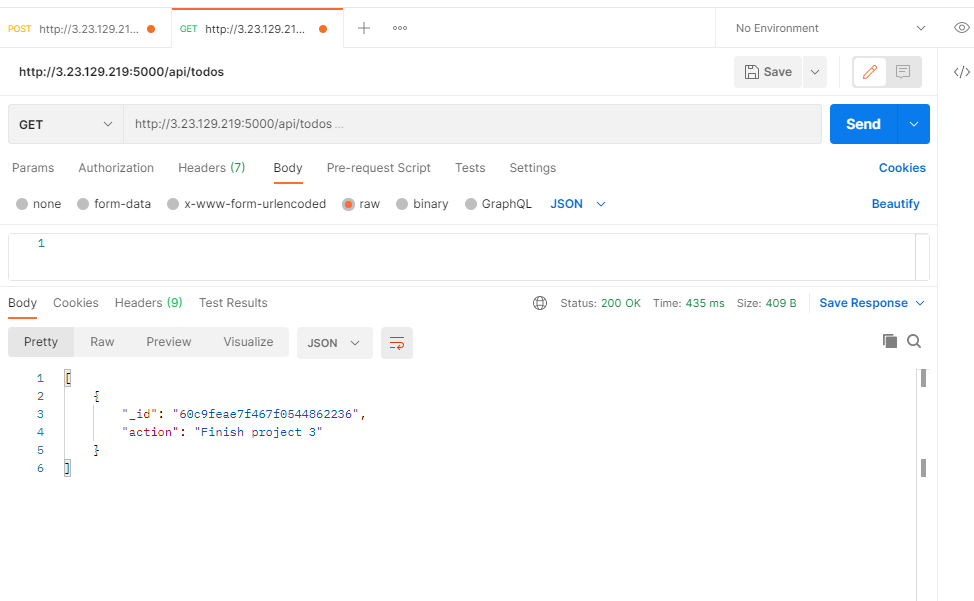
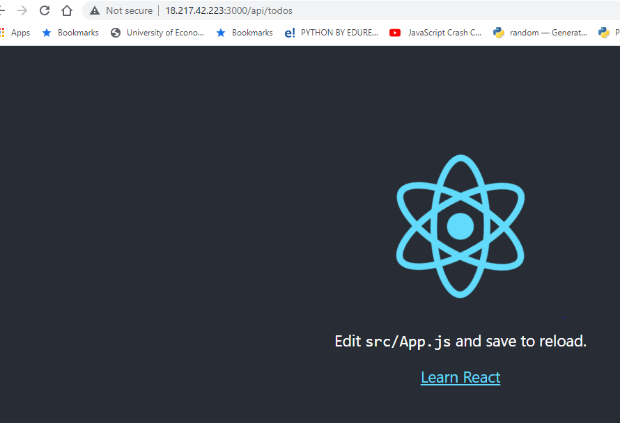
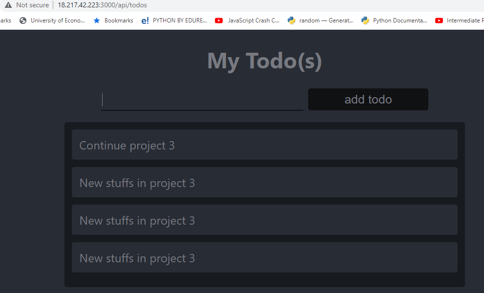

# **SIMPLE TO-DO APPLICATION ON MERN WEB STACK**
### Aim is to deploy a simple to-do application that creates To-do list.
## __Step 1 - Background Configuration__
A. 
* Perform system update   `sudo apt update`
* Perform system upgrade  `sudo apt upgrade`
* Install nodejs `sudo apt-get install -y nodejs`
    * $ mkdir Todo
    * $ cd Todo
    * use command `npm init`. This will install package.json
* Install ExpressJs `$ npm install express` 
* $ touch index.js
* Install the dotenv module `npm install dotenv`
* Open the index.js file `vim index.js`
B. 
* Start your server to see if it works `node index.js`
* Now open port 5000 on EC2 Security Groups
* Open your browser and access your server's public address or public DNS name using port 5000

        http://<PublicIP-or-PublicDNS>:5000

# __ROUTES__
Our To-do application needs to perform three tasks as follows:

    * Create a new task
    * Display list of all tasks
    * Delete a completed task
We will use different standard `HTTP request methods`: POST , GET and DELETE.
For each task, we need to create three `routes`.
    

# __MODELS__
We will model to define database schema. To create a Schema and a model, install `mongoose `which is a node.js package that makes working with `Mongodb` easier. 

        npm install mongoose

# __MongoDB Database__
We will use __mLab__. mLab provides MongoDB database as a service solution (DBaas).

In the `index.js` file, we specified `process.env` to access environment variables, but we have not yet created this file. So we need to do that now.

Create a file in your Todo directory and name it      `.env`.

        touch .env
        vi .env

Add the connection string to access the database in it, just as below:

`DB = 'mongodb+srv://<username>:<password>@<network-address>/<dbname>?retryWrites=true&w=majority'`

Update the content in `index.js` file.

Using environment variables to store information is considered more secure and best practice to separate configuration and secret data from the application, instead of writing connection strings directly inside the `index.js` application file.

Start your server using the command:

        node index.js

You should see a message ‘Database connected successfully’, if so - we have our backend configured.

## __Testing Backend Code using RESTFUL API__

You can use postman to test API. 

Open postman, create a __POST__ request to the API.

        http://<PublicIP-or-PublicDNS>:5000/api/todos

Create a __GET__ request to your API on 

        http://<PublicIP-or-PublicDNS>:5000/api/todos

## __Step 2 - Frontend Creation__

To start out with the frontend of the To-do app, we will use the `create-react-app` command to scaffold our app.

        npx create-react-app client

We need to install some dependencies like `concurrently` and `nodemon`.

        "proxy": "http://localhost:5000"

### __Creating your React Components__
 Make directory named `component` and create three files `Input.js` `ListTodo.js` and  `Todo.js` in this directory.

 Install Axios with  __*npm install axios*__.

Go back to Todo directory and run the following command.

        npm run dev
    

Credit:

link  darey.io

